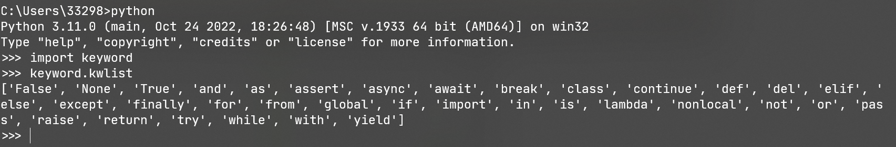

# Day 01 环境搭建和基础入门

## 提要

-   Typora 基本使用（略）
-   环境搭建
    -   Python 解释器 & 语法 [www.python.org]()
    -   环境变量 配置
    -   IDE 集成开发环境 (Pycharm)

## Python 安装目录

```python
\Python(version)
	python.exe 						# Python解释器
	\Scripts
		pip(version).exe			# pip安装
	\Lib
		\site-packages				# pip安装目录
```

## Python 语法

### 		编码

​	解释 + 编译

​	常见 charset ：UTF-8（Python3 默认使用编码格式）所有字符串都								是Unicode字符串

​								ASC-Ⅱ

​	可指定编码类型，例如：

```python
# -*- coding: cp-1252 -*-
```

### 标识符

-   第一个字符必须是字母表中字母或下划线 **_** 。
-   标识符的其他的部分由字母、数字和下划线组成。
-   标识符对大小写敏感。

​	在 Python 3 中，可以用中文作为变量名，非 ASCII 标识符也是允许的了。

### Python保留字

​	保留字即关键字，我们不能把它们用作任何标识符名称。Python 的标准库提供了一个 keyword 模块，可以输出当前版本的所有关键字：



### 注释

​	Python中单行注释以 **#** 开头，多行注释可以用多个 **#** 号，还有 **'''** 和 **"""**

```python
# 注释
# 注释

'''
注释
'''

"""
注释
"""
```

### 行与缩进

​	Python使用缩进来表示代码块，不需要使用`{}`，同一个代码块的语句必须包含相同的缩进空格数，否则会导致运行错误

### 多行语句

​	Python 通常是一行写完一条语句，但如果语句很长，我们可以使用反斜杠`\`来实现多行语句，例如：

```python
total = item_one + \
		item_two + \
		item_three
```

​	在 [], {}, 或 () 中的多行语句，不需要使用反斜杠`\`，例如：

```python
total = ['item_one', 'item_two', 'item_three',
        'item_four', 'item_five']
```

###  输出

​	例如： 找到在当前目录下，所有 png 格式的文件并打印

``` python
import os

for item in os.listdir("D:\Project\PycharmProjects\python_full_stack_Study\CodeExercise"):
    if item.endswith('png'):
        print(item)
```

​	不换行

```python
print("xxxx", end="")
print("yyyy")
```

### 数据类型

​	Python 中的变量不需要声明。每个变量在使用前都必须赋值，变量赋值以后该变量才会被创建。

​	在 Python 中，变量就是变量，它没有类型，我们所说的"类型"是变量所指的内存中对象的类型。

​	等号（=）用来给变量赋值。

​	等号（=）运算符左边是一个变量名,等号（=）运算符右边是存储在变量中的值。

#### 标准数据类型

​	Python3 中有六个标准的数据类型：

-   Number（数字）
-   String（字符串）
-   List（列表）
-   Tuple（元组）
-   Set（集合）
-   Dictionary（字典）

Python3 的六个标准数据类型中：

-   **不可变数据（3 个）：**Number（数字）、String（字符串）、Tuple（元组）；
-   **可变数据（3 个）：**List（列表）、Dictionary（字典）、Set（集合）。

#### 数字(Number)类型

​	python中数字有四种类型：整数、布尔型、浮点数和复数。

-   **int** (整数), 如 1, 只有一种整数类型 int，表示为长整型，没有 python2 中的 Long。
-   **bool** (布尔), 如 True。
-   **float** (浮点数), 如 1.23、3E-2
-   **complex** (复数), 如 1 + 2j、 1.1 + 2.2j

#### 字符串(String)

-   Python 中单引号 **`'`** 和双引号 **`"`** 使用完全相同。
-   使用三引号(**`'''`** 或 **`"""`**)可以指定一个多行字符串。
-   转义符 **`\`**。
-   反斜杠可以用来转义，使用 **`r`** 可以让反斜杠不发生转义。 如 `r"this is a line with \n"` 则 **`\n`** 会显示，并不是换行。
-   按字面意义级联字符串，如 `"this " "is " "string"` 会被自动转换为 `this is string`。
-   字符串可以用 **`+`** 运算符连接在一起，用 **`*`** 运算符重复。
-   Python 中的字符串有两种索引方式，从左往右以 **0** 开始，从右往左以 **-1** 开始。
-   Python 中的字符串不能改变。
-   Python 没有单独的字符类型，一个字符就是长度为 1 的字符串。
-   字符串的截取的语法格式如下：**`变量[头下标:尾下标:步长]`**

​	### 
